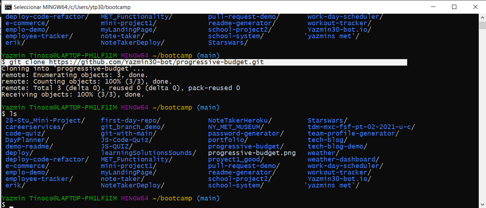

# Online/Offline Budget Trackers


## Description
  
The user will be able to add expenses and deposits to their budget with or without a connection. When entering transactions offline, they should populate the total when brought back online.

Offline Functionality:

Enter deposits offline

Enter expenses offline

When brought back online:

Offline entries should be added to tracker.

  
  
## Table of Contents
  
  *[Installation](#installation)
  
  *[Usage](#usage)
  
  *[Build-With](#build-with)

  *[Links](#links)

  *[Author](#author)
  
  *[Contributing](#contributing)
  
  *[Questions](#questions)

## Installation
  * Go to the following link [https://github.com/Yazmin30-bot/progressive-budget](https://github.com/Yazmin30-bot/progressive-budget/) and clone it 
  * Go to Git-bash and page the github's with the following code
    ```
    $ https://github.com/Yazmin30-bot/progressive-budget.git
    ``` 
    
  * When you first set up the project before installing any dependencies, make sure that your repo includes a package.json with the required dependencies. You can create one by running 
    ```
    npm init
    ``` 
  * For this project is needed to add the inquirer dependency to package.json file  
    ```
      "dependencies": {
        "compression": "^1.7.4",
        "express": "^4.17.1",
        "lite-server": "^2.5.3",
        "mongoose": "^5.5.15",
        "morgan": "^1.9.1"}
    ``` 
    

  * To install necessary dependencies, run the following command:
    ```
    npm install
    ```
## Usage
  * The application will be invoked by using the following command:

    ```bash
    npm start
    ```
  * The following images demonstrates the application functionality.  
     
   
## Build with 
  * [Javascript](https://www.javascript.com/) - `Javascript`
  * [NodeJs](https://nodejs.org/en/) - `NodeJs`

## Links
  * The URL of the deployed application.
  [https://cryptic-sands-21653.herokuapp.com/](https://cryptic-sands-21653.herokuapp.com/)
  * The URL of the GitHub repository.                                         [https://github.com/Yazmin30-bot/progressive-budget/](https://github.com/Yazmin30-bot/progressive-budget/)

## Author 
  * **`Yazmin Tinoco`**   - [Yazmin30-bot](https://github.com/Yazmin30-bot/)

## Contributing
  Pull requests are welcome. For major changes, please open an issue first to discuss what you would like to change. 


  
## Questions
  If you have any questions about the repo, open an issue or contact me directly at ytip30@gmail.com.
  You can find more of my work at [Yazmin30-bot](https://github.com/Yazmin30-bot/). 